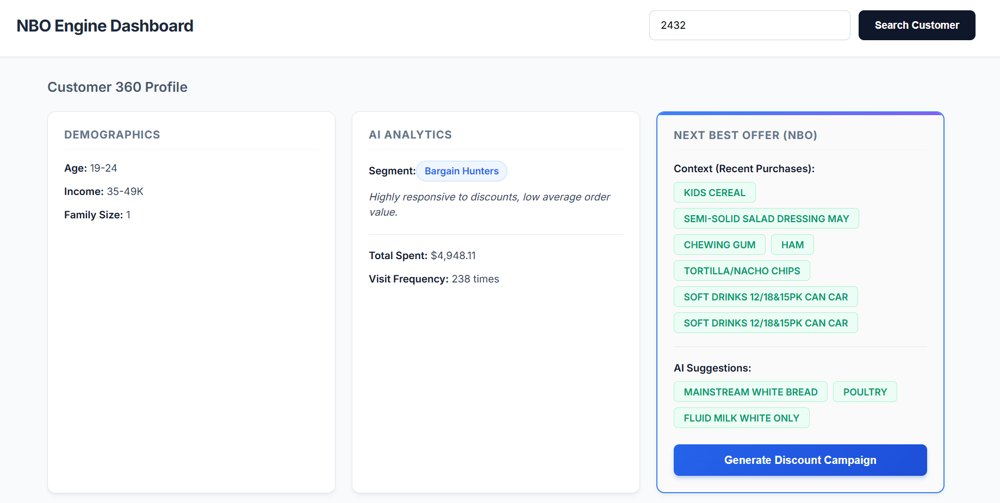

# NBO Engine

A full-stack enterprise microservices application demonstrating Market Basket Analysis, Customer Segmentation, and Next Best Offer (NBO) generation using Machine Learning.

## UI Previews


*Description: Customer search interface, demographic profile overview and dynamic Next Best Offer generation (FP-Growth).*


## Project Overview

This system acts as a decision-support tool for marketing departments. Instead of mass-mailing generic promotions, it allows managers to input a Customer ID and instantly receive:
1.  **Demographic Context**: Sourced from a relational database.
2.  **Behavioral Persona**: Customer segmentation cluster (e.g., "Bargain Hunters", "Loyal Big Spenders") calculated via K-Means clustering based on RFM (Recency, Frequency, Monetary) metrics.
3.  **Hyper-Personalized NBO**: Product recommendations calculated via the FP-Growth association rule algorithm, cross-referencing global store patterns with the customer's most recent actual basket.

## Architecture

The project follows a modern microservices architecture:

* **Frontend (Angular)**: A responsive, component-based UI simulating a CRM dashboard.
* **Core Backend (Java / Spring Boot)**: The aggregator service that orchestrates data flow. It fetches demographics from the database and calls the Python AI service for real-time predictions.
* **ML Service (Python / FastAPI)**: A high-performance REST API serving the pre-trained `scikit-learn` and `mlxtend` models. 
* **Database (PostgreSQL)**: Stores normalized transaction, household, and product data.

## The Dataset

This project utilizes the industry-standard **Dunnhumby "The Complete Journey"** dataset, which contains over 2.5 million household-level transactions.

**Handling Large Data on GitHub !!Not implemented yet!!:** 
Due to GitHub's file size limits, the raw `.csv` files have been compressed into `data.zip` (located in `ml_service/data/`). 
You do not need to manually download or extract anything. The Dockerized Python service is configured to automatically unzip this archive, run the ETL pipeline, train the ML models, and populate the PostgreSQL database upon the first container startup.

## Quick Start (Zero-Setup Deployment) !!Not implemented yet!!

The entire infrastructure is fully containerized using Docker multi-stage builds. You do not need Java, Python, Node.js, or PostgreSQL installed on your local machine.

### Prerequisites
* Docker and Docker Compose installed.

### Run Instructions !!Not implemented yet!!
1.  Clone the repository:
    ```bash
    git clone [https://github.com/MarcinTyszka/nbo-engine.git](https://github.com/MarcinTyszka/nbo-engine.git)
    cd nbo-engine
    ```
2.  Build and start all services:
    ```bash
    docker-compose up --build -d
    ```
3.  Wait a moment for the data to be seeded and models to be trained. Then, access the application:
    * **Frontend Dashboard**: http://localhost:4200
    * **FastAPI Swagger UI**: http://localhost:8000/docs
    * **Spring Boot Backend**: http://localhost:8080

## Technology Stack

* **Machine Learning**: Python, Pandas, Scikit-Learn (K-Means), MLxtend (FP-Growth), Joblib
* **Backend REST APIs**: Java 21, Spring Boot 3, Spring Data JPA, Python 3.10, FastAPI, Uvicorn
* **Frontend**: Angular, TypeScript, HTML5, CSS3
* **Database & DevOps**: PostgreSQL, pgAdmin, Docker, Docker Compose, Maven, Node Package Manager (npm)